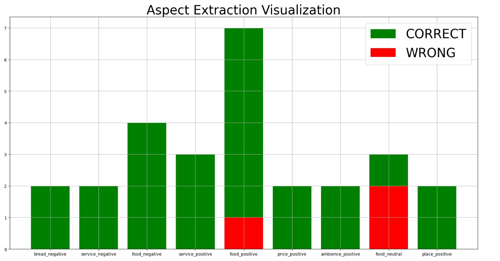

Here’s a professional `README.md` for your GitHub repository, structured for clarity and completeness. It will also include a section to explain the image file you mentioned.

---

# ABSA (Aspect-Based Sentiment Analysis) with GPT-3.5 and Sentence Transformers


## Overview

This project implements an **Aspect-Based Sentiment Analysis (ABSA)** system using **GPT-3.5** and **Sentence Transformers**. The system identifies aspects (topics) within customer reviews and determines the sentiment associated with each aspect. This implementation utilizes a combination of **sentence embeddings** to identify similar sentences and GPT-3.5 to provide sentiment classifications based on those aspects.

### Key Features

- **Preprocessing and Cleaning**: The system efficiently handles raw text, including stopword removal, lemmatization, and formatting.
- **Aspect Extraction**: Identifies specific topics or aspects in customer reviews.
- **Sentiment Classification**: Determines the sentiment polarity (positive/negative/neutral) for each identified aspect.
- **Embeddings and Similarity**: Uses Sentence Transformers to create text embeddings and calculates sentence similarity.
- **GPT-3.5 Powered**: Uses OpenAI's GPT-3.5 model to generate sentiment predictions.

## Table of Contents

- [Project Structure](#project-structure)
- [Installation](#installation)
- [Usage](#usage)
- [Model Details](#model-details)
- [Evaluation and Metrics](#evaluation-and-metrics)
- [Contributing](#contributing)
- [License](#license)

## Project Structure

```
├── absa.py                # Main Python script for ABSA model
├── requirements.txt       # Python dependencies
├── README.md              # Project documentation
├── data                   # Folder containing training data
│   └── Restaurants_Train_v2.xml  # Example dataset (modify path as needed)
├── results                # Folder containing results or output files
├── path-to-your-image-file.png  # Visualization image used in README
└── evaluation             # Evaluation scripts and metrics tracking
```

## Installation

1. Clone this repository:

    ```bash
    git clone https://github.com/yourusername/your-repo-name.git
    cd your-repo-name
    ```

2. Install the required dependencies:

    ```bash
    pip install -r requirements.txt
    ```

3. Make sure you have your **OpenAI API Key**. Replace the `"YOUR_KEY_HERE"` placeholder in the code with your actual API key.

## Usage

1. **Preprocessing and Training**:
   - Load the dataset in XML format (e.g., `Restaurants_Train_v2.xml`).
   - Clean and preprocess the text.
   - Generate embeddings using the pre-trained **Sentence Transformer** model.

2. **Aspect and Sentiment Extraction**:
   - Use sentence similarities to find relevant examples for training GPT-3.5.
   - Generate responses from GPT-3.5 to identify aspects and their sentiment polarity.

3. **Run the Script**:
   - Modify the script paths and dataset locations if necessary.
   - Run the main script:

    ```bash
    python absa.py
    ```

4. **Visualize Results**:
   - The script includes a section for evaluating results and plotting metrics for both aspect extraction and sentiment classification.

## Model Details

- **Sentence Transformer Model**: [all-MiniLM-L6-v2](https://huggingface.co/sentence-transformers/all-MiniLM-L6-v2)
  - Efficient and high-performance transformer model for embedding generation.
  
- **GPT-3.5**: Powered by OpenAI's GPT-3.5 for generating sentiment predictions.

## Evaluation and Metrics

After running the script, the evaluation metrics for **aspect extraction** and **sentiment polarity** classification will be calculated and visualized. The provided `MetricTracker` class will keep track of the model's performance, generating plots like the one shown below:



## Contributing

Contributions, issues, and feature requests are welcome! Feel free to check the [issues page](https://github.com/yourusername/your-repo-name/issues).

## License

This project is licensed under the MIT License - see the [LICENSE](LICENSE) file for details.

---

This `README.md` provides an overview, guides for installation and usage, and includes a reference to your image for visualization. 
